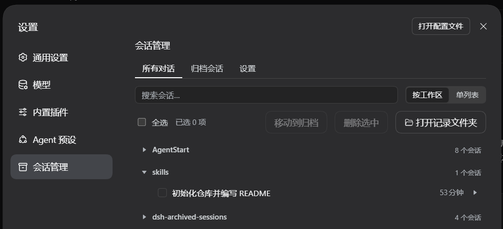
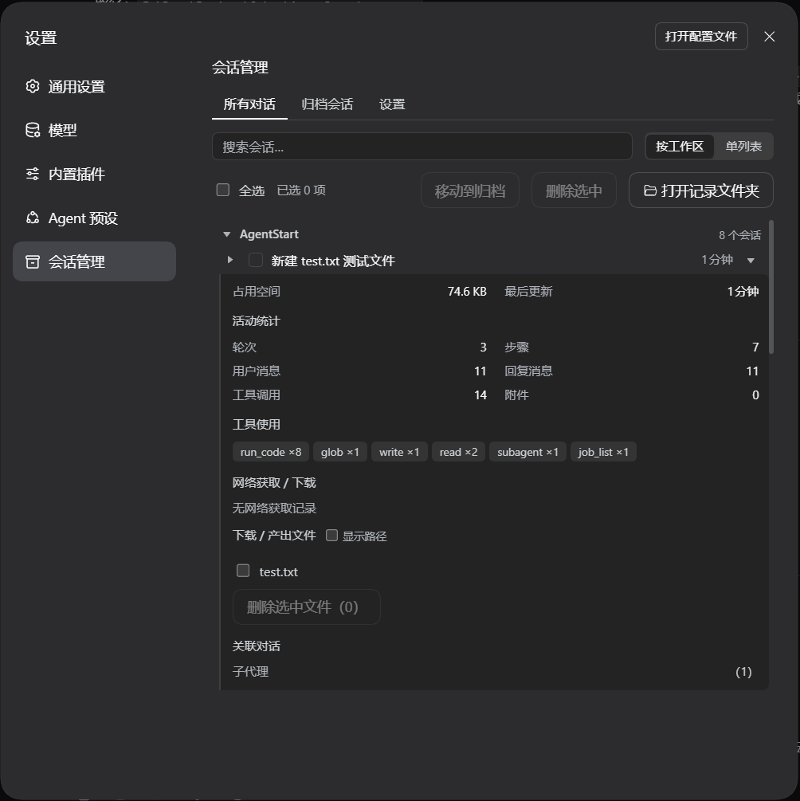
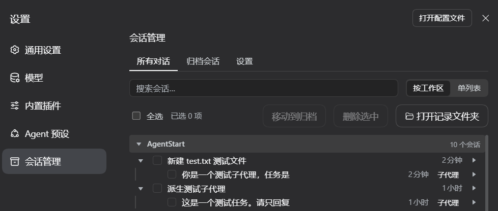
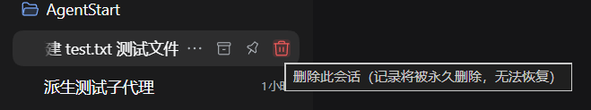
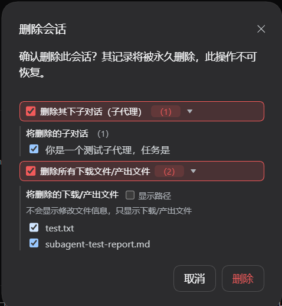
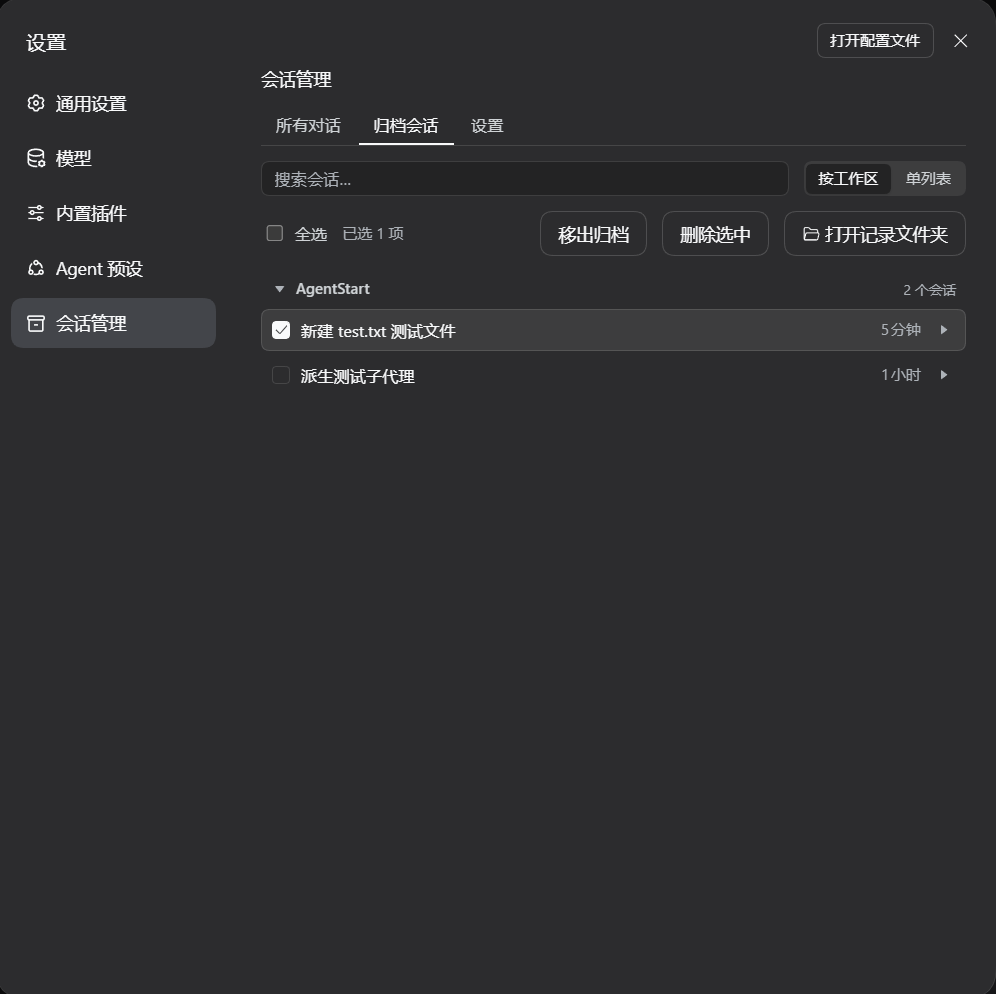
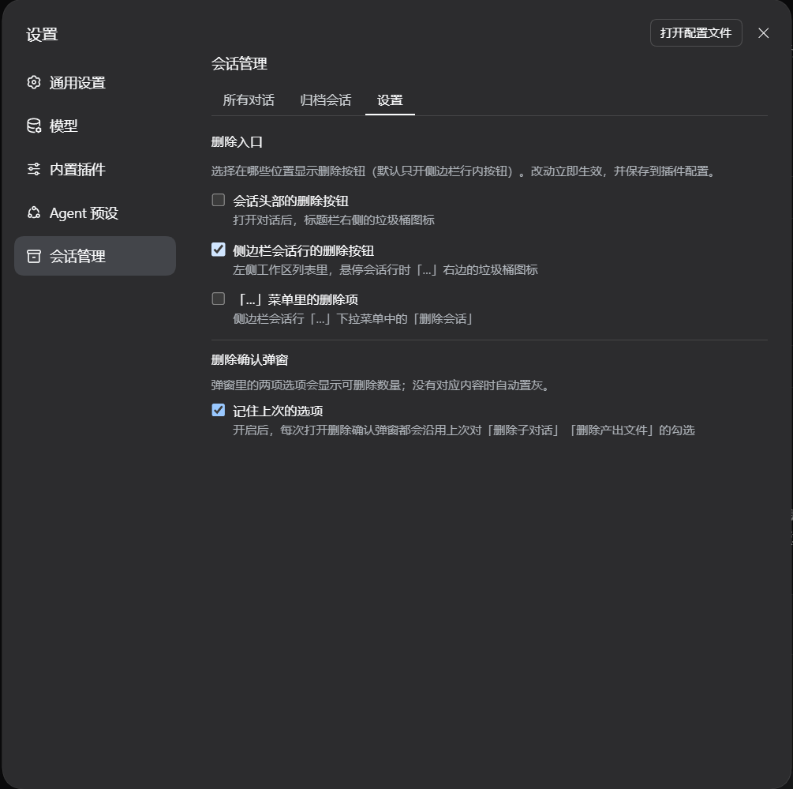

# dsh-archived-sessions（DSH 会话管理）

<div align="center">

[中文](#中文) | [English](#english)

</div>

## 中文

一个 DSH Web 插件：在「设置」中提供**会话管理**，统一管理本机上的所有对话。

> **Fork 声明**：本仓库是 [Zephyr-vibe/dsh-archived-sessions](https://github.com/Zephyr-vibe/dsh-archived-sessions) 的 **fork**，由 **AkotaP** 二次开发并维护（上游作者 Zephyr-vibe）；**本 fork 的仓库是 [AkotaP/dsh-archived-sessions](https://github.com/AkotaP/dsh-archived-sessions)**，安装与反馈都以它为准；版本号自 **0.2.0** 起与上游分开编号（上游最后发布的是 0.1.5）。上游的 MIT 许可与版权声明原样保留在 [LICENSE](LICENSE) 中；本 fork 的改动全部列在下方「更新日志 / Changelog」。
>
> 相对上游的主要改动：适配 **DSH 0.1.7-rc.2**（读取原语、图标改名、slot 变化）· 三处删除入口（标题栏 / 侧边栏「…」右边 / 「…」菜单里）与**独立开关**（走官方 settings 文档）· 分组视图可折叠 · 删除按钮危险红与悬停配色 · 删除弹窗选项计数/置灰与「记住上次的选项」 · 离线测试套件。

[English](#english)

### 功能

- **双标签页**：**所有对话**（未归档）与**归档会话**
- **视图切换**：**单列表**或**按工作区分组**（无工作区归属的会话兜底归入「未分组」）；分组视图里**点工作区标题即可折叠/展开**该组（标题前有三角指示、带 aria-expanded），「所有对话」与「归档会话」两个标签页都支持
- 按标题 + 相对时间浏览对话，最近的排在最前
- **搜索框**：按标题或 ID 实时过滤会话列表（「所有对话」与「归档会话」两个列表页都可用）
- 勾选 / **按住左键在会话行上滑动批量勾选**（按下那一行的状态决定方向：没勾＝连续加选，已勾＝连续取消；滑过的行跟着变，松开左键结束）/ 全选 / 批量**归档**（记录保留）/ 批量**删除**（永久删除，带确认弹窗）
- **三处「删除会话」入口**（0.1.7 适配）：官方在 0.1.7 重新开放了侧边栏行菜单（⋮）的插件注入点，因此删除入口有三处——**打开的会话标题栏**（🗑 垃圾桶图标）、**侧边栏会话行「…」右边的悬停按钮**、**侧边栏会话行「…」菜单里的「删除会话」项**；三处共用同一个细粒度确认弹窗，可勾选删除其下**子对话 / 下载·产出文件 / 整个文件夹**，默认只删会话本身。后两处与标题栏是否显示可在「会话管理 → 设置」里分别开关（默认只开「…」右边的悬停按钮）
- **删除确认弹窗的两项选项**：删除其下**子对话（子代理）**与**下载/产出文件**各自带一个可删数量徽标，勾选后整行转危险红强调；某项没有可删内容时整行置灰、复选框禁用（悬停说明「没有可删除的内容」）。开启「会话管理 → 设置 → 删除确认弹窗 → 记住上次的选项」后，每次打开弹窗都沿用上次对这两项的勾选
- 归档页支持**移出归档**（回到所有对话）
- **打开记录文件夹**按钮：在系统文件管理器中打开所选会话的记录目录，跨平台（`explorer` / `open` / `xdg-open`）
- 每行可展开详情（默认收起）：占用空间、最后更新、活动统计（轮次、步骤、消息数、工具调用分布、fetch 记录）、产出/下载文件、父会话与子会话（分叉）
- **子代理会话**嵌套显示在父会话下方（逐级缩进 + 左侧引导线 + 「子代理」徽标；父行永远与同级对齐，展开按钮不会把自己顶成「子对话」）；父会话被归档/过滤/删除而缺失时自动浮出为顶层行，并说明原因
- **删除父会话不会级联**：子代理、分叉、下载/产出文件均保留，除非你显式勾选它们——避免误删
- 当前打开的会话显示「当前会话」徽标，且**不可删除**

### 截图

<div align="center">
  
  <p>① 列表：按工作区分组，点工作区标题即可折叠 / 展开该组（标题前有三角指示）</p>
</div>

<div align="center">
  
  <p>② 详情：展开某一行，查看占用空间、活动统计、产出文件与关联对话</p>
</div>

<div align="center">
  
  <p>③ 子代理：子对话嵌套在父会话下（逐级缩进 + 左侧引导线 + 「子代理」徽标）</p>
</div>

<div align="center">
  
  <p>④ 删除入口：侧边栏会话行「…」右边的删除按钮（悬停提示：删除此会话——记录将被永久删除，无法恢复）</p>
  <br />
  
  <p>⑤ 删除确认弹窗——可勾选删除其下子对话 / 下载·产出文件 / 整个文件夹</p>
</div>

<div align="center">
  
  <p>⑥ 归档：归档会话标签页，勾选后点「移出归档」即可放回「所有对话」</p>
</div>

<div align="center">
  
  <p>⑦ 设置：三个删除入口开关 + 删除确认弹窗的「记住上次的选项」</p>
</div>

### 安装

#### 方式一：直接 tarball 安装

```sh
dsh plugin --profile web add https://codeload.github.com/AkotaP/dsh-archived-sessions/tar.gz/refs/heads/main
```

如果 pnpm 拦截构建脚本，在命令末尾加 `--ignore-scripts`：

```sh
dsh plugin --profile web add https://codeload.github.com/AkotaP/dsh-archived-sessions/tar.gz/refs/heads/main --ignore-scripts
```

#### 方式二：让 agent 安装

告诉你的 DSH 智能体：

```text
帮我把这个项目安装为插件：https://github.com/AkotaP/dsh-archived-sessions
```

agent 会下载项目、放入 profile 的 `node_modules` 并注册到 `dsh.profile.bundles`。

安装后重启 web 端，即可在「设置」中看到「会话管理」入口。

### 兼容性

- **零配置**：会话目录按官方 DSH 布局（`$DSH_HOME/sessions/<project-key>/<session-id>/`）自动识别，无需核心补丁
- **归档 / 恢复**：基于官方 `archiveSession` 相同的 `registry` 状态原语实现
- **删除不级联**：只删除所选会话，子代理、分叉与文件均保留；运行中的会话拒绝删除（409）
- **API 仅信任本机请求**（127.0.0.1 / localhost / ::1）；仅使用官方公开 API（`workspaceRegistry`、`sessionPersistence`、`sessionQuery`）
- **核心版本**：面向 **DSH 0.1.7-rc.2**（0.1.5 引入的 SessionHandle / `sessionQuery` 读取路径）

### 开发与测试

```bash
pnpm install          # 依赖（宿主半边必须自带：@deepseek-ai/schemastery）
pnpm test             # 等价于在仓库根跑 node --test；不需要 DSH，也不需要浏览器
```

> 测试脚本就是 `node --test`（自动发现 `test/**/*.test.mjs`）。`test/support/harness.mjs` 也会被当成一个空测试文件跑一遍，属正常现象。

测试用"桩模块图 + 迷你 React"直接跑构建产物（`lib/index.js` / `lib/client.js`），覆盖三类契约：

- **界面契约**：五个 slot 的名字/order/id、菜单项结构（危险色 + 分隔线，且菜单树里没有弹窗）、点选→`shell.overlay` 弹窗→`POST /archived/api/delete`、分组折叠（两个标签页）、弹窗文案与危险类、fresh install 默认值、样式规则与"条目 id 与 `cordis.patch.yml` 一致"
- **配置通道**：宿主 `Config` 三字段 `volatile`、`volatileForm`/`isVolatilePath` 能投影与写入、客户端 `configForms` 读取/写入/失败提示（绿字闪一下、红字常驻）
- **host API**：运行中会话 409 `session-busy`、只允许 loopback、参数校验、已下线的私有 config 接口保持 404

改动后至少保证 `pnpm test` 全绿再提交。

### 更新日志

#### 0.2.0

> **版本号：0.2.0——本 fork 的首个独立发布号。** 上游最后发布的是 0.1.5；本批既有新功能（三处删除入口与开关、分组折叠、删除弹窗的计数与选项记忆、产出文件识别修复……），也提升了依赖与核心版本要求，所以按 0.x 语义进位到次版本，而不是补一个 0.1.6。
>
> **背景：适配 DSH 核心 0.1.7-rc.2 更新。** 0.1.5 起的 SessionHandle 重构移除了 `sessionPersistence.inspect/readRaw/artifactInfo`，也移除了 `@deepseek-ai/dsh-session` 的 `decodeStorageRecord` 导出（后者会让 host 端**直接加载失败**）；`persistence.list()` 的返回从裸 header 变为 `{ header, revision, sizeBytes }` 快照，客户端的 `workspaces` 服务也不再提供 `refresh()`。本版本针对这些变化重做读取链路并更新依赖范围。

- **修复：插件在 0.1.7 上完全无法加载**——host 端 `import { decodeStorageRecord }` 引用的导出已被移除（ESM 具名导入直接抛错，整个插件不激活）；该导入连同依赖它的原生日志回落路径一并移除（0.1.5 起日志可能压缩存储，按文本逐行解析已不成立）
- **适配：会话详情改走新的读取原语**——优先 `sessionQuery.observeSession(id, { projectionMode: "none" })`（官方 `inspectApiSession` 同款），其次 `sessionPersistence.open(id, "read")` + `handle.read()`，两者都给出 `{ meta, events }`
- **适配：`persistence.list()` 新形状**——`{ header, revision, sizeBytes }` 快照统一归一化回 header（同时兼容旧版裸 header），血缘、子代理收集与孤儿归档清理全部走同一入口
- **适配：live 会话事件**——`Session.events` 字段已改为 `snapshotEvents()` 方法
- **适配：磁盘占用**——`artifactInfo()` 并入 `stat()`；取不到大小时只显示 `—`，不再让整个详情请求失败
- **适配：客户端目录刷新**——`workspaces` 服务不再有 `refresh()`（改为 Host 推送模型），刷新改为「有则调用」，保留 `sessions.refresh()`
- **新增：「…」菜单里的删除项**——注册到官方 slot `sidebar.workspaces.session.menu.item`（`order: 450`，排在官方 置顶/重命名/分支/归档 之后），用官方 `MenuItemButton` 渲染：危险色（`danger`）+ 上方分隔线（`separatorBefore`）+ 同一个垃圾桶图标与同一个细粒度确认弹窗；按官方约定先 `useMenuOpenState` 收菜单，再向浮层弹窗登记请求
- **修复：「…」菜单里的删除点了没反应**——确认弹窗原先和菜单项写在同一个组件里，而菜单项本身就是 `Menu` 的 children，会随菜单一起卸载；`setMenuOpen(false)` 与 `setOpen(true)` 在同一次事件里批处理，组件一卸载弹窗也跟着消失（没有报错、没有任何反应）。现在弹窗移到 `shell.overlay` 的常驻条目里（官方 rename/archive 同款做法），菜单项只负责登记「要删哪个会话」，点击后正常弹出同一个细粒度确认框
- **新增：「删除入口」开关（3 个），本页批量删除常驻**——插件新增 `deleteInHeader` / `deleteInSidebar` / `deleteInMenu` 三个开关，默认**只开**侧边栏「…」右边的悬停按钮，会话头部与「…」菜单项默认关闭；在「会话管理 → 设置」标签页以开关呈现（且只在设置页渲染），经官方 settings 文档读写（host `Config` 的三个 `volatile()` 字段，客户端 `ctx.configForms.get("dsh-archived-sessions")`）；关闭后对应入口不再渲染。本页工具栏的批量删除按钮改为常驻，不再设开关
- **修复：「删除入口」开关重启后复原**——两个真问题叠在一起：① 浏览器端的 `configForms` 服务由兄弟插件 `@deepseek-ai/dsh-client-ui-settings` 提供，而 cordis 的服务查找只沿父链走、运行时的 facade 还按 `inject` 声明做门禁，插件原先只用宽容读取 `ctx.get("configForms")` 取服务，拿到的是 `undefined`——写入根本没发出过；② 接上服务后才暴露真正原因：官方 settings 文档只投影在 `Config` 上标了 `volatile()` 的字段（`dsh-settings` 的 `volatileForm`/`isVolatilePath`），而本插件用的 schemastery 3.18 没有那个补丁，宿主直接以「no volatile fields」拒绝写入。修法是把整条链路接回官方：①依赖从上游裸包 `schemastery@3.18.0` 换成 DSH fork **`@deepseek-ai/schemastery@3.18.4`**（`volatile()` 是 DSH 的补丁，上游与 npm 上的 3.18.2 都没有；宿主半边走 Node 原生解析，第三方插件必须把它装进自己的 `node_modules`），②`Config` 三个字段补上 `.volatile()`，③客户端 `inject` 声明 `configForms` 并用 `ctx.configForms.get(entryId)` + `form.set()` 读写（写入带 revision，冲突/拒绝由官方处理），④撤掉临时的私有存储与 `/archived/api/config*` 接口。设置页底部不再常驻说明行：保存成功闪一行绿字（约 2.5 秒后自动收起），读写失败则红字给出宿主原文，不再静默失败。重新挂载（热更新或依赖重启）时开关与状态会先复位，避免沿用上一轮残留
- **新增：分组视图可折叠**——工作区标题变成可点的按钮：点一下折叠该组（组内会话隐藏，标题与本组计数保留），再点展开；前面是三角指示（展开时旋转 90°）、带 aria-expanded 与「展开/折叠分组」无障碍标签。顺带修掉一个老限制：分组视图此前只在「所有对话」里生效，「归档会话」标签页无论选什么都退化成单列表——官方归档只是在工作区归属上叠加的标记位（归档会话保留它的 sessionIds 槽位），所以归档页也能按工作区分组了；搜索框与视图切换因此改为两个列表标签页都显示
- **调整：弹窗里的确认按钮**——两个删除确认弹窗（本页批量删除、单个会话删除）的确认按钮原来都显示「删除选中」（单个会话时尤其别扭），现在统一为「删除」，并套用危险红（--dsw-alias-state-error-primary，与官方删除按钮同一套）；工具栏的批量按钮仍保留「删除选中」，以免丢失「选中」语义
- **配色：删除按钮改用危险红**——静止为 `--dsw-alias-state-error-secondary`（浅红），悬停与聚焦转为 `--dsw-alias-state-error-primary`（正红），跟随浅/深主题自动适配；侧边栏行内按钮与会话头部按钮统一
- **修复：热更新后 CSS 不生效 + 删除按钮的悬停配色**——插件的样式块原先只在"head 里还没有同名 `<style>`"时才投放，客户端热更新后旧标签还在，于是之后所有 CSS 改动（危险红、悬停、分组标题、状态行…）都看着"改了没用"；现在每次加载先移除同名标签再重新投放。垃圾桶按钮的悬停色也修好了：官方 `.iconButton:hover` 与本插件规则同为单类权重，文档顺序一变就可能被压掉，所以基础态与悬停态统一改成双类名（`aRchv_rowDelete.aRchv_rowDelete`），静止是 `--dsw-alias-state-error-secondary`（浅红）、悬停/聚焦转 `--dsw-alias-state-error-primary`（正红）并叠一层 `--dsw-alias-interactive-bg-hover-danger` 红色底、0.15s 过渡；弹窗里的删除按钮悬停也套同一个红底与红字（和「…」菜单里的危险行一致，不再是一片白）
- **新增：侧边栏会话行的删除入口**——注册到官方 slot `sidebar.workspaces.session.row.action`（`order: 300`，落在官方 `archive`(100)/`pin`(200) 之后，即「…」按钮右边最末位），复用同一个细粒度确认弹窗；行内 16px 变体与官方按钮同尺寸，静止色同官方三级文字色、悬停转为危险红（`--dsw-alias-state-error-primary`）；会话头部的删除按钮保留
- **修复：设置页与会话头部整块空白（React error #130）**——0.1.7 把 `dsh-client-ui-primitives` 的图标导出从「尺寸后缀」改成「字重后缀」（`IconCheckOutline16` → `IconCheckOutlineRegular`、`IconTriangleRightFill14` → `IconTriangleRightFillRegular` 等），插件引用的 4 个旧名字变成 `undefined`，React 渲染当场抛 #130，slot 被错误边界整块吞掉（表现为页面空白）；现在 12 处引用统一走跨版本取值 `旧名 → 新名 → 空组件兜底`，旧核与新核都能渲染
- **依赖与引擎声明更新**：`peerDependencies` 只保留必需的 `@deepseek-ai/cordis@^4.0.1`，核心版本改由新增的 `engines.dsh`（`>=0.1.7-rc.2`）约束——npm 语义化版本下 prerelease 范围只匹配同一 `0.1.x`，旧的 `^0.1.0-rc.6` 匹配不到当前核心；客户端用到的 DSH 包统一由 `dsh.client.inject` 声明。
- **删除确认弹窗「选项记忆」开关**——设置页新增第二个分区（宿主 `Config` 的第四个 `volatile()` 字段 `rememberDeleteOptions`，默认关）：开启后每次打开删除确认弹窗都沿用上次对「删除子对话」「删除产出文件」两项的勾选（细粒度选择依赖具体会话与文件路径，跨弹窗没有意义，故不记忆）；记忆值存在浏览器 `localStorage`，刷新页面后仍然沿用，无存储环境时只在本次运行内有效
- **调整：删除弹窗两项选项的呈现**——两项各自带一个可删数量徽标（子对话数 / 产出文件数），勾选后整行套危险红底、红边框与红色复选框（accent-color），未勾选为中性边框；数量为 0 时整行置灰、虚线边框、复选框禁用，悬停提示「没有可删除的内容」，一眼就能看出有没有子对话/文件产出；置灰时若「选项记忆」开着且上次勾选过，仍保留勾选态（置灰只表示这次没东西可删，不必强行抹掉勾选）
- **修复：有子对话时「产出文件」数量要等 1~2 秒**——详情读取原先按「主会话 → 每个子对话」串行请求，有子对话就是"一个子对话一个来回"；现在限制 6 路并发，并**边扫边刷新**：扫到第一个产出文件就立刻解除置灰，后续响应只更新数字（还没扫完且一个都没发现时显示「（…）」），不必等全部扫完。确认删除时若扫描还没结束，会先等它落定并**补上点下确认之后才发现的文件**，避免只删到一半那部分（用户手动取消勾选过的文件不会被重新勾上）
- **内部：两个删除弹窗共用同一个选项行渲染器**（`deleteOptionRow`），设置面板批量删除与会话头部/侧边栏删除弹窗不再各写一份
- **修复：新版 harness 下「产出/下载文件」永远是空的**——0.1.7 起 agent 只能直接调 `run_code`，真正的 `write`/`edit`/`pwsh` 调用由代码内部派发，落盘为 `tool/ptc-dispatch-start`（调用）与 `tool/ptc-dispatch`（结果），而插件的文件判定只认外层 `tool/call` 中名字等于 `write`/`edit` 的事件，于是**所有新会话**的详情面板产出文件、删除弹窗「删除产出文件」的计数与单个文件删除（归属校验要求路径在 `details.files` 里）全部失效。现在两种记录形状走同一套收集，内层调用同样计入工具分布与 fetch 记录（同一次调用的 `ptc-dispatch` 结果不重复计数）
- **修复：用相对路径创建的产出文件被漏掉**——`file_path` 记的是原始入参（常见 `test.txt` 这类相对路径），插件却直接拿它 `stat()`，基准是宿主进程 cwd、与会话项目目录无关，必然 ENOENT 被过滤。现在相对路径一律按会话 cwd 绝对化，`write`/`edit` 还会优先取工具结果里的 `<path>…</path>`（工具自己解析过的绝对路径）
- **修复：展开过的会话详情会一直用旧快照**——详情按会话做了 LRU 缓存（上限 50），命中后直接返回、不再请求，于是"先展开看过、之后又产出文件"的会话在页面刷新前始终显示旧的文件列表。现在命中缓存只用于首帧直出，每次展开都后台重取一次（有缓存时不显示 loading，失败也不清空面板），新产出的文件点开就能看到
- **修复：折叠层级显示（父行看着像子对话）**——展开/收起按钮原来渲染在行内、且排在复选框前面，父行内容会被这颗 20px 按钮 + 8px 间距顶出去 28px，比它自己的子代理（缩进 21px）还靠右；多级时更糟：每一层只要「自己有下级」就再被顶出一次，而它的下一层只缩进 16px，于是**隔层反向**（父比子靠右）反复出现，整棵树读不出来。现在每行都预留同宽的挂件栏（没有下级就是空占位），父行永远停在基线，展开按钮不再影响任何行的对齐；缩进只由子代理承担，并且改用 `margin-left` 表达层级（第 1 级 9px，之后每级 +16px），左侧 2px 引导线随层级右移，父子方向永远正确；`depthOf` 同时修好了一个旧 bug——非子代理会话当父行时，它的孙级拿不到 depth，多级缩进此前实际不生效。三处同源问题一并处理：① 子代理的**父行被归档或搜索过滤掉**时不再硬缩进（按顶层行 + 「子代理」徽标渲染，悬停提示「父会话「X」不在当前列表」），不再看着像挂在紧邻的无关对话下面；② 搜索命中子代理、但其父被过滤掉时**子代理会正常显示**（此前整行消失）；③ 展开箭头只按**当前列表可见**的子代理计数，归档页/搜索后不再出现点开却是空的「死箭头」。

- **文档：README / USAGE 与本批代码一起刷新**——仓库地址统一指向本 fork（`AkotaP/dsh-archived-sessions`），截图换成当前 UI 并补齐「分组折叠」「设置」两张（旧的 `删除.jpg`/`删除详细.jpg`/`子智能体.jpg` 已替换为同名 `.png`），USAGE 手册补上「按住左键在会话行上滑动即可连续勾选 / 取消」的批量选择说明、三个删除入口与设置页开关，版本号对齐 0.2.0（本 fork 从 0.2.0 起改用独立版本号：上游最后发布的是 0.1.5，而本批既有新功能、也有依赖与核心要求的提升）

#### 0.1.5

> **背景：适配 DSH 核心 0.1.0-rc.8 更新。** rc.8 移除了官方 `workspaceRegistry.deleteSession` 与 `sessionPersistence.remove`，官方侧边栏会话行菜单（⋮）也只保留 重命名/分叉/归档 且不再开放插件注入点——本版本针对这些变化重做删除链路、补回删除入口，并修复升级过程中暴露的若干问题。

- **修复：删除后 live 会话残留（核心 rc.8 兼容）**——rc.8 移除官方删除原语后，旧版删除只做工作区 detach + 磁盘清理，会漏掉仍挂在 sessions store 里的 live 会话：删除后它依旧出现在列表，且因工作区已 detach 而落入「未分组」（重启后才会消失）；现在删除前先 flush 全部目标会话日志，删除后用官方公开原语 `SessionStore.liveEntryFor + detachEntered` 摘除 live 会话（广播 `session/disposed`，持久化状态同步清理），并保持 0.1.3 的「只删自己 / 不级联」语义不变
- **修复：删除会话后残留空文件夹**——「删除文件」模式（filePaths）与「保留文件」模式（deleteFiles=false）之前只删记录 log、会话目录残留为空壳；现在所有删除分支最终都会清理会话目录（工作区产出文件不受影响），并等待 persistence retire 落定后兜底重删（防尾部 flush 自动 mkdir 重建目录）
- **修复：点开会话详情面板崩溃变空**——文件分组代码引用了浏览器端不存在的 node `sep` 变量（0.1.4 回归），当会话产出文件位于工作区内子文件夹时抛 `ReferenceError: sep is not defined`，被错误边界捕获后整个会话管理区域空白；已改为字面分隔符拼接
- **「删除会话」按钮从行菜单移到会话头部（rc.8 适配）**——rc.8 侧边栏行菜单（⋮）不再开放插件注入点（只剩 重命名/分叉/归档），删除入口改放到打开的会话头部操作区（官方 `conversation.session.header.actions` slot，自动携带 sessionId），带确认弹窗走 `/archived/api/delete`，发布后任何导入本插件的部署都能获得删除能力
- **头部删除弹窗带细粒度选项**：与设置面板一致——可勾选删除其下**子对话（子代理，含孙级）**与**下载/产出文件**（可展开查看具体列表、显示路径开关），默认都不勾选（只删会话本身）
- **增强：头部删除弹窗显示可整删的文件夹节点**——文件按父目录归组，工作区根以下的子文件夹显示为 📁 节点（可展开、可勾选整删），工作区根本身绝不可整删；details API 新增返回 `cwd` 作为根判断依据（取不到 cwd 时宁可不推导文件夹）
- **修复：头部删除弹窗展开详情崩溃**——`baseName` 原本定义在设置面板组件闭包内，头部删除弹窗访问不到（`ReferenceError: baseName is not defined`，slot 入口崩溃导致删除按钮消失）；已提升为模块级函数，两处共用
- **增强：检测 shell 命令创建的产出文件**——详情/删除的文件列表原先只认 `write`/`edit` 工具的 `file_path`；现在也解析 `pwsh`/`bash` 的 `Set-Content`/`Add-Content`/`Out-File`/`New-Item` 及 `>`/`>>` 重定向中的路径（经 stat+isFile 存在性过滤，排除目录与残留 token）

#### 0.1.4

- **详情面板关联对话区**：只显示子代理个数（父会话/分叉不再列出）
- **删除弹窗子代理区**：只显示子代理（含孙级等全部后代），标题带个数
- **文件列表完善**：树形文件夹展开、列表滚动、显示路径开关（默认只显示文件名）、文件夹路径与文件一致
- **文件夹行样式统一**：与文件行完全相同的组件与样式，无间距差异；箭头展开/收起带旋转动画
- 删除会话/删除文件后**自动清理空父目录**（直到非空或工作区根，根目录绝不删除）
- 已物理删除的文件不再出现在详情/删除弹窗（host 端 stat 过滤）
- 修复：文件列表包含子代理产出、id 格式兼容（`session-` 前缀）、工作区外文件兜底显示文件名

#### 0.1.3

- **删除确认弹窗升级**：两行确认；可细粒度勾选删除的子代理（含孙级）与下载/产出文件，默认都不勾选
- **删除级联与文件选项**：删除会话时可一并删除其下子代理（cascade / subagentIds）、下载与产出文件（filePaths，含整个文件夹）
- **文件夹删除安全规则**：工作区根目录绝不删除；子文件夹可整删（递归）；删除后自动清理空目录（逐级直到非空或工作区根）
- **文件列表树形显示**：文件夹可展开查看内部文件；列表超出时滚动显示；"显示路径"开关（默认只显示文件名，实时切换完整路径）
- **默认按工作区分组**；视图切换按钮顺序调整（按工作区在前）
- 修复：子代理收集双向 id 匹配（`session-` 前缀兼容）、文件列表包含子代理产出、工作区外文件兜底显示文件名

#### 0.1.2

- **搜索框**：按标题或 ID 实时过滤会话列表
- **详情面板活动统计**：轮次、步骤、用户/助手消息、工具调用分布与 fetch 记录
- **更安全的文件删除**：只能删除该会话的产出文件（拒绝目录），带确认弹窗与失败汇总
- 批量操作**分批执行**（每批 20 个）——选中数百会话不再压垮浏览器
- 父会话删除后，孤儿子代理会话在工作区视图仍可见
- 详情子会话不再重复列出；单个工作区异常不再阻塞整次删除
- 相对时间自动刷新；键盘（Tab + Enter/Space）选择；拖拽选择在窗口外释放不再卡住
- 打开记录文件夹支持无工作目录会话（`_no-cwd` 布局）；删除不存在的会话返回 404
- 详情响应有界（文件 ≤ 200、fetch ≤ 50），大会话保持流畅

#### 0.1.1

- 子代理会话**默认折叠**，点击父行箭头展开/收起
- 子代理跟随父会话归入正确的**工作区分组**（不再落入「未分组」）
- 删除父会话**不再级联**：子代理、分叉与文件均保留，除非显式勾选
- 打开记录文件夹按钮；批量归档/恢复/删除带确认；当前会话保护
- 纯净 Harness **零配置**——仅使用官方 API，无核心补丁

#### 0.1.0

- 首个版本：双标签（所有对话/归档会话）、单列表/按工作区视图、批量归档与删除、详情展开、子代理嵌套

### 许可证

MIT — © 2026 Zephyr-vibe

---

## English

A DSH web plugin: a **Session Manager** in Settings — manage every conversation on this machine in one place.

> **Fork notice**: this repository is a **fork** of [Zephyr-vibe/dsh-archived-sessions](https://github.com/Zephyr-vibe/dsh-archived-sessions), further developed and maintained by **AkotaP** (original work by Zephyr-vibe) — **this fork lives at [AkotaP/dsh-archived-sessions](https://github.com/AkotaP/dsh-archived-sessions)**, which is the canonical source for installing it and filing issues; versioning diverges from upstream at **0.2.0** (upstream last shipped 0.1.5). The upstream MIT license and copyright notice are kept verbatim in [LICENSE](LICENSE); every change made by this fork is listed under Changelog below.
>
> Main differences from upstream: adapted to **DSH 0.1.7-rc.2** (read primitives, renamed icon exports, new slots) · three delete entry points (title bar / right of the sidebar "…" / inside the "…" menu) with **independent switches** backed by the official settings document · collapsible workspace grouping · destructive-red delete affordances · delete-dialog option counts, disabled-empty options and a "remember the last choice" switch · an offline test suite.

[中文](#中文)

### Features

- **Two tabs**: **All conversations** (non-archived) and **Archived**
- **View modes**: **flat list** or **grouped by workspace** (sessions without a workspace fall back to "Ungrouped"); in the grouped view **clicking a workspace heading collapses/expands that group** (a disclosure triangle plus aria-expanded), and both the All conversations and Archived tabs support it
- Browse conversations by title + relative time, newest first
- **Search box**: filter the session list by title or id in real time (available on both list tabs)
- Checkbox / **press-and-drag multi-select** (holding the left button on a row picks the direction — "add" when that row was unchecked, "remove" when it was checked — and every row you slide over follows it; releasing the button ends the gesture) / select-all / batch **archive** (records kept) / batch **delete** (permanent, with a confirmation modal)
- **Three "Delete session" entry points** (0.1.7 adaptation): 0.1.7 reopened the sidebar row menu (⋮) to plugins, so there are now three — the **opened session's title bar** (🗑 trash icon), the **hover button right of a sidebar row's "…" trigger**, and a **"Delete session" row inside that "…" menu**; all three share one fine-grained confirmation dialog that lets you optionally delete this session's **sub-conversations / downloaded·produced files / whole folders**, with nothing checked by default (only the session itself). The latter two, and the title-bar button, can each be switched off under Session manager → Settings (only the "…"-right hover button starts on)
- **The two delete-dialog options** — sub-conversations (subagents) and downloaded/produced files — each carry a count badge and turn destructive-red when checked; an option with nothing to delete is greyed out and disabled (hover explains "nothing to delete"). With Settings → Delete confirmation dialog → "Remember the last choice" on, every dialog reuses your last selections
- **Unarchive** from the Archived tab (move back to All conversations)
- **Open record folder** button: opens the selected session's record directory in your OS file manager — cross-platform via `explorer` / `open` / `xdg-open`
- Expand each row for details (collapsed by default): size on disk, last update, activity stats (turns, steps, messages, tool-call distribution, fetch history), produced/downloaded files, parent and child (fork) sessions
- **Subagent sessions** are shown nested under their parent conversation (per-level indent, a guide line and a "subagent" badge; a parent row always aligns with its own level and the disclosure control never pushes it into looking like a child); when the parent is archived, filtered out or deleted they surface as top-level rows with the reason on hover
- **Deleting a parent session does NOT cascade**: subagent children, forks, and downloaded/produced files are kept unless you explicitly select them — nothing is lost accidentally
- The currently open session shows a **Current** badge and **cannot be deleted**

### Screenshots

<div align="center">
  
  <p>① List: grouped by workspace — click a heading to collapse / expand that group</p>
</div>

<div align="center">
  
  <p>② Details: expand a row for size on disk, activity stats, produced files and related conversations</p>
</div>

<div align="center">
  
  <p>③ Subagents: sub-conversations nested under their parent (per-level indent, guide line, "subagent" badge)</p>
</div>

<div align="center">
  
  <p>④ Delete entry: the delete button right of the "…" trigger on a sidebar row (tooltip: delete this session — the record will be permanently removed)</p>
  <br />
  
  <p>⑤ Delete confirmation dialog — optionally delete sub-conversations / downloaded·produced files / whole folders</p>
</div>

<div align="center">
  
  <p>⑥ Archive: the Archived tab — select rows and "Unarchive" to move them back</p>
</div>

<div align="center">
  
  <p>⑦ Settings: three delete-entry switches plus "Remember the last choice"</p>
</div>

### Install

#### Option 1: Direct tarball install

```sh
dsh plugin --profile web add https://codeload.github.com/AkotaP/dsh-archived-sessions/tar.gz/refs/heads/main
```

If pnpm blocks build scripts, append `--ignore-scripts`:

```sh
dsh plugin --profile web add https://codeload.github.com/AkotaP/dsh-archived-sessions/tar.gz/refs/heads/main --ignore-scripts
```

#### Option 2: Let an agent install it

Tell your DSH agent:

```text
帮我把这个项目安装为插件：https://github.com/AkotaP/dsh-archived-sessions
```

The agent downloads the repo, places it into the profile's `node_modules`, and registers it in `dsh.profile.bundles`.

After installing, restart the web app — the Session Manager appears in Settings automatically.

### Compatibility

- **Zero config**: session directories are auto-detected from the official DSH layout (`$DSH_HOME/sessions/<project-key>/<session-id>/`) — no core patches
- **Archive / unarchive**: built on the same `registry` state primitives as the official `archiveSession`
- **Non-cascading delete**: only the selected session is removed; subagents, forks and files are kept; running sessions are rejected (409)
- **Loopback-only API** (127.0.0.1 / localhost / ::1); official public APIs only (`workspaceRegistry`, `sessionPersistence`, `sessionQuery`)
- **Core version**: built for **DSH 0.1.7-rc.2** (the SessionHandle / `sessionQuery` read path introduced in 0.1.5)

### Development & tests

```bash
pnpm install          # @deepseek-ai/schemastery must be installed for the host half
pnpm test             # equivalent to `node --test` at the repo root; no DSH, no browser
```

> The script is simply `node --test` (auto-discovering `test/**/*.test.mjs`); `test/support/harness.mjs` also gets executed as an empty test file, which is expected.

The suites drive the built artifacts (`lib/index.js` / `lib/client.js`) through a stub
module graph and a mini React runtime, and lock three contracts: the surface
(five slots, the destructive menu row without a dialog inside it, select → `shell.overlay`
dialog → `POST /archived/api/delete`, grouping on both tabs, dialog wording, defaults, the
entry id matching `cordis.patch.yml`), the settings channel (volatile `Config` fields,
`volatileForm`/`isVolatilePath`, client read/write plus green/red status lines), and the host
API (running-session 409, loopback-only, input validation, retired private endpoints).

### Changelog

#### 0.2.0

> **Version: 0.2.0 — the fork's first standalone release number.** Upstream last shipped 0.1.5; this batch adds features (three delete entries with switches, collapsible grouping, delete-dialog counts and option memory, produced-file detection fixes, …) and raises the dependency and core requirements, so it advances the minor version instead of shipping a 0.1.6.
>
> **Background: adaptation to the DSH core 0.1.7-rc.2 update.** The SessionHandle rework that began in 0.1.5 removed `sessionPersistence.inspect/readRaw/artifactInfo` as well as the `decodeStorageRecord` export of `@deepseek-ai/dsh-session` (the latter made the host half **fail to load outright**); `persistence.list()` changed from bare headers to `{ header, revision, sizeBytes }` snapshots, and the client `workspaces` service dropped `refresh()`. This release reworks the read pipeline against those changes and refreshes the dependency ranges.

- **Fix: the plugin could not load at all on 0.1.7** — the host half imported `decodeStorageRecord`, whose export is gone (an ESM named import throws, leaving the whole plugin inactive); that import and the raw-log fallback built on it are removed (logs may be stored compressed since 0.1.5, so line-by-line text parsing no longer holds)
- **Adapted: session details use the new read primitives** — `sessionQuery.observeSession(id, { projectionMode: "none" })` first (the same call the official `inspectApiSession` makes), then `sessionPersistence.open(id, "read")` + `handle.read()`; both yield `{ meta, events }`
- **Adapted: the new `persistence.list()` shape** — `{ header, revision, sizeBytes }` snapshots are normalized back to headers (bare legacy headers still work), so lineage, subagent collection and orphaned-archive cleanup share one entry point
- **Adapted: live session events** — the `Session.events` field was replaced by the `snapshotEvents()` method
- **Adapted: disk usage** — `artifactInfo()` folded into `stat()`; an unreadable size now shows `—` instead of failing the whole detail request
- **Adapted: client catalogue refresh** — the `workspaces` service no longer offers `refresh()` (the Host pushes its model), so the refresh calls it only when present and keeps `sessions.refresh()`
- **New: a delete row inside the Session row’s “…” menu** — registered into the official `sidebar.workspaces.session.menu.item` slot (`order: 450`, after the shipped pin/rename/fork/archive rows) and rendered with the shipped `MenuItemButton`: destructive colours (`danger`), a hairline above (`separatorBefore`), the same trash icon and the same fine-grained confirmation dialog; per the slot contract it closes the menu through `useMenuOpenState` and then files a request with the overlay dialog
- **Fix: the delete row inside the “…” menu did nothing when clicked** — the confirmation dialog used to live in the same component as the menu row, and a menu row is a `Menu` child, so it unmounts with the menu; `setMenuOpen(false)` and `setOpen(true)` were batched into one event, so the component (and the dialog with it) was gone in the same commit — no error, no visible reaction. The dialog now lives in a persistent `shell.overlay` entry (the same approach the shipped rename/archive actions use) while the menu row only records which Session to delete, so clicking it opens the usual fine-grained confirmation dialog
- **New: three delete entry-point switches, with this page’s batch button always on** — the plugin gains `deleteInHeader` / `deleteInSidebar` / `deleteInMenu`, and only the sidebar hover button right of the “…” trigger starts **on** (the session header and the “…” menu row start off); they are surfaced as switches on the Session manager’s Settings tab (rendered on that tab only), read and written through the official settings document (the three `volatile()` fields of the Host `Config`, via the client's `ctx.configForms.get("dsh-archived-sessions")`); a disabled entry stops rendering. This page’s toolbar batch-delete button is now unconditional and has no switch
- **Fix: the delete-entry switches reverted after a restart** — two real problems stacked: (1) the browser-side `configForms` service is provided by the sibling plugin `@deepseek-ai/dsh-client-ui-settings`, and cordis resolves services along the parent chain only while the runtime facade additionally gates property access on the `inject` declaration, so the plugin's tolerant read `ctx.get("configForms")` returned `undefined` — the write was never even sent; (2) with the service reachable, the real cause surfaced: the official settings document only projects fields marked `volatile()` on the `Config` (`dsh-settings`' `volatileForm`/`isVolatilePath`), and the schemastery 3.18 this plugin uses has no such patch, so the Host refused the write outright as "no volatile fields". The fix wires the whole chain back to the official path: (1) the dependency moves from the upstream `schemastery@3.18.0` to the DSH fork **`@deepseek-ai/schemastery@3.18.4`** (`.volatile()` is a DSH patch that neither upstream nor npm's 3.18.2 carries, and since the host half resolves bare imports with plain Node rules a third-party plugin has to install it into its own `node_modules`), (2) the three `Config` fields regain `.volatile()`, (3) the client injects `configForms` and reads/writes through `ctx.configForms.get(entryId)` + `form.set()` (writes carry a revision, so conflicts and refusals are the framework's), and (4) the temporary private store and its `/archived/api/config*` endpoints are gone. The Settings tab no longer carries a permanent note: a successful save flashes a green line (auto-hidden after about 2.5s), and a failed read or write shows the Host's own text in red instead of failing silently. Re-mounting (hot reload or a dependency restart) first resets the switches and the status so nothing stale carries over
- **New: collapsible groups in the grouped view** — a workspace heading is now a clickable button: one click collapses its group (the rows hide while the heading and its count stay), another expands it, with a disclosure triangle (rotated 90° when open) plus aria-expanded and an expand/collapse accessible label. It also fixes an old limitation: the grouped view used to work only on **All conversations**, so the **Archived** tab degraded to a flat list whatever you picked — official archiving is just a flag layered over workspace accounting (an archived session keeps its sessionIds slot), so the Archived tab groups by workspace too; the search box and view switch are therefore shown on both list tabs
- **Changed: the confirmation button inside the dialogs** — the two delete dialogs (this page's batch delete and the single-session delete) both read “Delete selected”, which was especially odd for one Session; they now read “Delete” and use the destructive red (--dsw-alias-state-error-primary, the same token the shipped delete button uses). The toolbar batch button keeps “Delete selected” so the selection semantics stay visible
- **Colour: delete buttons turn destructive red** — they rest at `--dsw-alias-state-error-secondary` (muted red) and switch to `--dsw-alias-state-error-primary` (full red) on hover and focus, adapting to the light/dark theme; the sidebar row button and the Session-header button share it
- **Fix: CSS did not apply after a hot reload, plus the delete buttons' hover colours** — the plugin's style block was only injected when no `<style>` with that id was already in the head, so after a client hot reload the stale tag stayed and every later CSS change (danger red, hovers, group headings, the status line…) looked like it had no effect; each load now removes the tag it owns before re-adding it. The trash buttons' hover colour is fixed too: the shipped `.iconButton:hover` has the same single-class weight as this plugin's rule, so a change in document order could override it; both the rest and hover states now use a doubled class (`aRchv_rowDelete.aRchv_rowDelete`), resting at `--dsw-alias-state-error-secondary` (muted red) and turning `--dsw-alias-state-error-primary` (full red) on hover/focus with a `--dsw-alias-interactive-bg-hover-danger` fill and a 0.15s transition; the dialog's delete button gets the same red fill and text on hover (matching the destructive row in the "…" menu instead of staying white)
- **New: a delete entry on Session rows in the sidebar** — registered into the official `sidebar.workspaces.session.row.action` slot (`order: 300`, landing after the shipped `archive`(100)/`pin`(200), i.e. rightmost after the "…" trigger) and reusing the same fine-grained confirmation dialog; the inline 16px variant matches the shipped buttons' size, rests at the official tertiary label colour and turns destructive red on hover (`--dsw-alias-state-error-primary`); the Session-header delete button stays
- **Fix: blank settings page and blank session header (React error #130)** — 0.1.7 renamed the `dsh-client-ui-primitives` icon exports from size suffixes to weight suffixes (`IconCheckOutline16` → `IconCheckOutlineRegular`, `IconTriangleRightFill14` → `IconTriangleRightFillRegular`, …), so the four legacy names the plugin imported became `undefined`: React threw #130 on render and the error boundary swallowed the whole slot (showing an empty page); all twelve references now resolve across versions as `legacy name → current name → no-op component`, rendering on both cores
- **Dependency and engine declarations updated**: `peerDependencies` now keeps only the required `@deepseek-ai/cordis@^4.0.1`, and the core version is pinned through a new `engines.dsh` (`>=0.1.7-rc.2`) — under npm semver a prerelease range only matches the same `0.1.x`, so the old `^0.1.0-rc.6` range cannot match the current core; DSH packages used by the client half are declared via `dsh.client.inject`.
- **New: a delete-dialog "remember my choice" switch** — the Settings tab gains a second section (the host `Config`'s fourth `volatile()` field, `rememberDeleteOptions`, off by default): when on, every delete dialog reuses your last sub-conversation / produced-file choices (fine-grained selections depend on the specific sessions and paths, so they are not remembered); the remembered state lives in the browser's `localStorage` and survives a page reload, and without storage it lasts for the run only
- **Changed: how the two dialog options are presented** — each option now carries a count badge (sub-conversations / produced files) and turns destructive-red (red fill, red border, red checkbox accent) when checked, staying neutral when unchecked; a count of 0 greys the whole row out with a dashed border, disables its checkbox and explains "nothing to delete" on hover, so it is obvious at a glance whether there is anything to delete. A greyed option keeps the remembered check when the option memory is on — greying only means "nothing to delete this time" and does not wipe the remembered choice
- **Fix: the produced-file count took 1–2 seconds with subagents around** — the detail reads used to run as "parent → each subagent", one round-trip each; they now run at most 6 in parallel and refresh **as they land**: the first produced file immediately un-greys the option and later responses only update the count (while the scan is incomplete with nothing found yet it shows "（…）"), instead of waiting for every session. If the scan is still running when you confirm, the dialog waits for it and **adds the files discovered after the click** so it never deletes just the half it had seen (files you unchecked yourself are not re-added)
- **Internal: both delete dialogs now share one option-row renderer** (`deleteOptionRow`) instead of each keeping its own copy
- **Fix: "produced/downloaded files" was always empty on current Harnesses** — since 0.1.7 the agent can only call `run_code` directly, so the real `write`/`edit`/`pwsh` calls are dispatched from inside the code run and persisted as `tool/ptc-dispatch-start` (the call) plus `tool/ptc-dispatch` (its result), while the detector only looked at outer `tool/call` events named `write`/`edit`. Every new Session therefore listed no files, the delete dialog's "delete produced files" count stayed at zero, and per-file deletion was refused (ownership requires the path to be in `details.files`). Both shapes now feed one collector, and inner calls also count toward the tool distribution and the fetch history (a dispatch result never double-counts)
- **Fix: produced files created through a relative path were dropped** — `file_path` holds the raw argument (often relative, e.g. `test.txt`) and the plugin `stat()`ed it as-is against the Host process cwd, which has nothing to do with the Session's project directory, so the existence check failed and the file was filtered out. Relative paths are now anchored to the Session cwd, and `write`/`edit` prefer the absolute `<path>…</path>` their own result reports
- **Fix: an expanded row kept serving a stale detail snapshot** — details were cached per Session (LRU, 50 entries) and a hit returned without refetching, so a Session you had expanded before kept showing its old file list until the page reloaded. A cache hit now only paints the first frame: every expand issues a background refetch (no loading state while cached data exists, and a failure never blanks the panel), so newly produced files appear as soon as you re-open the row
- **Fix: the collapsed hierarchy read as "the parent is a child"** — the expand/collapse button used to sit inside the row *before* the checkbox, so a parent row's content was pushed 28px right (20px button + 8px gap), further right than its own subagent child (21px of indent). With three levels it got worse: every level that had children of its own was pushed out again while its own children indented only 16px, so the parent/child direction **flipped on every other level** and the tree was unreadable. Every row now reserves a fixed-width disclosure slot (an empty placeholder on leaves), so a parent row always stays on the baseline and the control never shifts any row; indentation is carried by subagent rows only and expressed as `margin-left` (level 1 = 9px, +16px per level) with the 2px guide line moving right with the level, so a child is always right of its parent. `depthOf` also fixes an old bug where a non-subagent parent never produced depths for its grandchildren, so multi-level indentation silently did nothing. Three related cases came along: (1) a subagent whose parent is archived or filtered out is now listed as a top-level row with the badge and a "parent conversation X is not in this list" tooltip instead of hard-indenting under an unrelated neighbour; (2) searching for a subagent whose parent is filtered out now shows it (it used to vanish entirely); (3) the disclosure arrow counts only the subagents visible in the current list, so the archived tab and search no longer leave dead arrows that expand to nothing.

- **Docs: README / USAGE refreshed with this batch** — repository links now point at this fork (`AkotaP/dsh-archived-sessions`), the screenshots match the current UI (two new ones for collapsible grouping and the Settings tab, and the old `删除.jpg` / `删除详细.jpg` / `子智能体.jpg` are replaced by same-named `.png` files), the USAGE manual documents press-and-drag selection ("hold the left button and slide over rows to keep checking or unchecking them"), the three delete entry points and the Settings switches, and version numbers are aligned to 0.2.0 (the fork's first standalone release number — upstream last shipped 0.1.5, while this batch adds features and raises the dependency / core requirements)

#### 0.1.5

> **Background: adaptation to the DSH core 0.1.0-rc.8 update.** rc.8 removed the official `workspaceRegistry.deleteSession` and `sessionPersistence.remove`, and the official sidebar row menu (⋮) now keeps only Rename / Fork / Archive with no plugin injection point — this release reworks the delete pipeline, restores a delete entry, and fixes several issues surfaced by the upgrade.

- **Fix: live session left behind after delete (core rc.8 compatibility)** — with the official delete primitives gone, the old delete path only detached the workspace and removed disk files, leaving the live session still mounted in the sessions store: it kept appearing in the list, and with its workspace gone it fell into "Ungrouped" (vanishing only after a restart); deletion now flushes all target logs first, then detaches the live session through the official public primitives `SessionStore.liveEntryFor + detachEntered` (broadcasts `session/disposed`, persistence state cleaned up in turn), keeping the 0.1.3 "delete only the selected session / no cascade" semantics
- **Fix: empty session folder left after delete** — the "delete files" mode (`filePaths`) and "keep files" mode (`deleteFiles:false`) previously removed only the record log, leaving the session directory as an empty shell; every delete branch now cleans up the session directory in the end (workspace-produced files are unaffected), and waits for the persistence retirement to settle before a final idempotent re-remove (guarding against the tail flush auto-`mkdir` recreating the directory)
- **Fix: session detail panel crashing blank** — the file-grouping code referenced the browser-absent node `sep` variable (a 0.1.4 regression); with produced files inside a workspace sub-folder it threw `ReferenceError: sep is not defined`, and the error boundary blanked the whole session-manager area; now joined with a literal separator
- **The "Delete session" button moved from the row menu to the session header (rc.8 adaptation)** — since rc.8 the sidebar row menu (⋮) no longer exposes a plugin injection point (only Rename / Fork / Archive remain); the delete entry now lives in the opened session's header actions (official `conversation.session.header.actions` slot, which carries the sessionId), with a confirmation dialog calling `/archived/api/delete`, and works in any deployment that imports the plugin
- **Header delete dialog with fine-grained options**: same as the settings panel — optionally delete the session's **sub-conversations (subagents, incl. grandchildren)** and **downloaded/produced files** (expandable lists, show-paths toggle); nothing checked by default (only the session itself is deleted)
- **Enhance: header delete dialog shows deletable folder nodes** — files are grouped by parent directory; sub-folders under the workspace root appear as 📁 nodes (expandable, checkable for whole-folder delete), and the workspace root itself can never be deleted; the `details` API now returns `cwd` as the root check basis (when `cwd` is unavailable no folder nodes are derived at all)
- **Fix: header delete dialog crash on expanding details** — `baseName` lived inside the settings-panel component closure, unreachable from the header delete dialog (`ReferenceError: baseName is not defined`, slot entry crashed and the delete button vanished); hoisted to module scope, shared by both
- **Enhance: detect produced files created via shell** — the details/delete file list previously recognized only `write`/`edit` tool `file_path`s; it now also parses paths in `pwsh`/`bash` `Set-Content`/`Add-Content`/`Out-File`/`New-Item` and `>`/`>>` redirects (filtered by a `stat`+`isFile` existence check, dropping directories and stray tokens)

#### 0.1.4

- **Detail "related conversations"**: now shows only the subagent count (parent / forks no longer listed)
- **Delete dialog subagent section**: shows only subagents (all descendants incl. grandchildren), with a count
- **File list polish**: tree-style folder expansion, scrolling, "show paths" toggle (filenames by default), folder paths consistent with files
- **Folder rows share the exact file-row component/style** — no spacing drift; arrow expand/collapse with rotation animation
- Deleting a session or file **prunes empty parent directories** (up to the first non-empty dir or the workspace root; roots are never deleted)
- Physically deleted files no longer appear in details / delete dialogs (host-side stat filter)
- Fixes: file list includes subagent outputs; id format tolerance (`session-` prefix); files outside workspace roots fall back to filenames

#### 0.1.3

- **Upgraded delete confirmation**: two-line confirm; fine-grained selection of subagents (incl. grandchildren) and downloaded/produced files, nothing checked by default
- **Cascade & file options**: deleting a session can also remove its subagents (`cascade` / `subagentIds`) and its downloaded/produced files (`filePaths`, including whole folders)
- **Folder deletion safety**: workspace roots are never deleted; sub-folders can be removed recursively; empty parent directories are pruned automatically (up to the first non-empty dir or the workspace root)
- **Tree-style file list**: folders expand to show their files; the list scrolls when long; a "show paths" toggle (filenames by default, full paths in real time)
- **Workspace view by default**; view switch order adjusted (workspace first)
- Fixes: bidirectional subagent id matching (`session-` prefix tolerant), file list includes subagent outputs, files outside workspace roots fall back to filenames

#### 0.1.2

- **Search box**: filter the session list by title or id in real time
- **Activity stats** in the detail panel: turns, steps, user/assistant messages, tool-call distribution and fetch history
- **Safer file deletion**: only files produced by the session can be deleted (directories rejected), with a confirmation dialog and all-settled error summary
- Batch operations now run in **batches of 20** — selecting hundreds of sessions no longer floods the browser
- Orphan subagent sessions (parent deleted) are visible again in the workspace view
- Detail lineage no longer lists the same subagent twice; a failing workspace no longer blocks an entire delete
- Relative timestamps refresh automatically; keyboard (Tab + Enter/Space) selection; drag-select no longer sticks after releasing outside the window
- Open-record-folder now works for sessions without a working directory (`_no-cwd` layout); deleting a missing session returns 404
- Detail responses are bounded (files ≤ 200, fetches ≤ 50) so huge sessions stay snappy

#### 0.1.1

- Subagent sessions are now **collapsed by default** and expand on click (expand/collapse arrow on the parent row)
- Subagents follow their parent into the correct **workspace group** (no longer dumped into "Ungrouped")
- Deleting a parent session is now **non-cascading**: subagents, forks, and files are kept unless explicitly selected
- Open-record-folder button; batch archive / unarchive / delete with confirmation; current-session protection
- **Zero config** on stock Harness — official APIs only, no core patches

#### 0.1.0

- Initial release: two tabs (All conversations / Archived), flat / by-workspace views, batch archive & delete, detail expansion, subagent nesting

### License

MIT — © 2026 Zephyr-vibe
